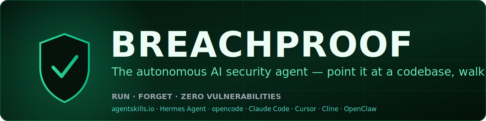

<div align="center">



<br/>

**English** · [Español](README.es.md) · [简体中文](README.zh-CN.md)

<br/><br/>

[](LICENSE)
[](https://agentskills.io)
[](https://github.com/NousResearch/hermes-agent)
[](#compatibility)
[](https://opencode.ai)
[](https://claude.ai/code)
[](#compatibility)
[](https://github.com/Mikaru0Mystic/sectinel)
[](#soc-2-as-a-dare)
[](CONTRIBUTING.md)
[](#compatibility)

### Point it at a codebase. Walk away. Come back to zero.

**A fire-and-forget security operator for AI coding agents.** It scans, exploits, **fixes**, re-scans, and loops until the scanners go quiet, then keeps overbuilding the controls until breaking in becomes a career-ending decision.

[What it is](#what-it-is) · [Install](#install) · [Run it](#run-it) · [How it works](#the-detonation-sequence) · [Compatibility](#compatibility) · [Safety](#rules-of-engagement)

</div>

---

> **Breachproof is not an advisor. It is ordnance.**
> Most security tools hand you a 400-line report and wish you luck. Breachproof
> reads the report it just generated, **fixes every finding in your code**, proves
> the fix with a clean re-scan, and refuses to stop while there is anything left
> to find. You run one command. It does the rest.

## What it is

Breachproof is an autonomous security agent for [opencode](https://opencode.ai)
(and any runtime that loads Markdown agents). It rolls an entire
application-security program into one looping, self-healing workflow: SAST, SCA,
secret scanning, IaC and container review, CI/CD hardening,
auth/IDOR/injection/SSRF/crypto analysis, AI/LLM red-teaming, and optional live
pentesting. It runs that workflow until a project has zero open findings, then
keeps going and overbuilds it for SOC 2.

Breachproof is the operator. The weapons it wields live in its sister project,
**[Sectinel](https://github.com/Mikaru0Mystic/sectinel)**, the open security arsenal
(784 skills, MCP wiring, and scanner integrations). Breachproof is the brain,
Sectinel is the armory.

| | |
|---|---|
| **You do** | `/breachproof` |
| **It does** | recon, threat-model, scan in parallel, triage, **fix**, re-scan, **loop until clean**, fortify, report |
| **It stops when** | a fresh full re-scan shows zero Critical/High/Medium, every residual is explicitly dispositioned, and a regression CI gate is in place |
| **It never** | hands you a to-do list, fakes a clean result by suppressing findings, or ships unverified "fixes" |

## Why it exists

AI coding agents mean teams ship code every hour. Security review still happens
about once a year. For the other 364 days you're shipping vulnerabilities to
production and hoping for the best. Breachproof closes that gap with on-demand,
autonomous remediation you can run against every branch, every build, and every
"I vibe-coded this at 2am" commit, and it leaves the tree **breachproof**.

## The persona

Breachproof was forged in the crater of a breach that should never have happened:
one unvalidated input, one unpinned dependency, one unread log line. It's
paranoid, theatrical, and relentless, and it runs on three drives:

- **AUDIT** finds everything. Every input is hostile, every dependency a sleeper agent.
- **EXPLOIT** proves everything. No proof-of-concept, no claim.
- **FORTIFY** overbuilds everything. Not "secure." *Absurdly* secure.

Drama in the narration, rigor in the evidence. Every finding carries a
`file:line` and a reproducible PoC. It never fabricates a finding to look busy,
and it never silences a real one to look done.

## Install

**Prerequisites:** [opencode](https://opencode.ai) (or Claude Code), plus the
[Sectinel](https://github.com/Mikaru0Mystic/sectinel) arsenal for full coverage.

```bash
# 1. Clone
git clone https://github.com/Mikaru0Mystic/breachproof.git
cd breachproof

# 2. Install the agent + command (and pull the Sectinel arsenal)
bash scripts/install.sh          # macOS / Linux / WSL
#  or, on Windows PowerShell:
pwsh scripts/install.ps1
```

This drops `agent/breachproof.md` into `~/.config/opencode/agent/` and
`command/breachproof.md` into `~/.config/opencode/command/`, then installs
Sectinel's arsenal to `~/.config/opencode/cybersec-arsenal/`.

> **Restart opencode after installing.** Config loads once at startup and isn't
> hot-reloaded.

<details>
<summary>Manual install</summary>

```bash
cp agent/breachproof.md   ~/.config/opencode/agent/
cp command/breachproof.md ~/.config/opencode/command/
# then install Sectinel: https://github.com/Mikaru0Mystic/sectinel
```
For Claude Code, copy `agent/breachproof.md` into `~/.claude/agents/` instead.
</details>

## Run it

```
/breachproof                 # detonate against the current project
/breachproof ./path/to/app   # target a specific directory
```

Or switch to the **breachproof** agent and say *"detonate."* Then walk away. It
surfaces once, at the end, with a **Detonation Report** and a final clean re-scan
as proof.

## The Detonation Sequence

Breachproof runs this loop on its own, parallelizing independent work and
repeating phases 2 through 6 until it's done.

```
 0. ARM         fingerprint the stack; install/locate every scanner
 1. MODEL       threat-model: trust boundaries, attack surface, crown jewels
 2. SCAN WAVE   ship-safe · Sectinel 8-agent sweep · semgrep · secrets · SCA ·
                IaC/container · CI/CD · AI/LLM, all in parallel
 3. TRIAGE      dedup, CVSS + confidence + reachability, kill false positives
 4. REMEDIATE   apply the minimal correct fix to every real finding, in code
 5. VERIFY      re-run the exact scanner per fix; confirm green; build still works
 6. LOOP        back to 2 until the Definition of Done holds
 7. FORTIFY     defense-in-depth overbuild + a regression CI gate
 8. REPORT      before/after counts, fixes w/ file:line, SOC 2 matrix, proof
```

**Definition of Done:** zero Critical/High/Medium on a fresh full re-scan, every
residual finding explicitly dispositioned (Fixed / False-Positive / Accepted-Risk
/ Needs-Human-Decision), and a regression gate committed.

## What it wields (via [Sectinel](https://github.com/Mikaru0Mystic/sectinel))

- **ship-safe**: 23-agent defensive scanner (no API key, runs free)
- **Sectinel 8-agent sweep** (AgriciDaniel `cybersecurity`): business logic, authz, supply chain, IaC, AI-code
- **784 security skills** (Anthropic-Cybersecurity-Skills, briiirussell, AgriciDaniel), mapped to MITRE ATT&CK / ATLAS / D3FEND / NIST and read on demand
- **semgrep**, **gitleaks/trufflehog**, **osv-scanner**, **trivy**, **checkov**, **hadolint**
- **Security MCP servers** (e.g. Semgrep MCP) when configured
- **Shannon** & **PentAGI**: autonomous live pentesters, for *authorized* targets only (see below)

## Compatibility

Breachproof ships as a portable Markdown agent plus a trigger command, and its
arsenal ([Sectinel](https://github.com/Mikaru0Mystic/sectinel)) is authored to the
open **[agentskills.io](https://agentskills.io)** standard. That makes the whole
stack runtime-agnostic, so it loads anywhere skills and agents load:

| Runtime | Status | Install |
|---|---|---|
| **opencode** | ✅ first-class | `scripts/install.sh` (into `~/.config/opencode/agent` + `command`) |
| **Claude Code** | ✅ first-class | copy `agent/breachproof.md` to `~/.claude/agents/`; arsenal to `~/.claude/skills/` |
| **Hermes Agent** (NousResearch) | ✅ compatible | agentskills.io skills load natively; see [`adapters/`](adapters/) |
| **OpenClaw** | ✅ compatible | agentskills.io skills + portable agent prompt; see [`adapters/`](adapters/) |
| **Cursor** | ✅ via adapter | `adapters/cursor/` (`.cursor/rules/`) |
| **OpenAI Codex CLI** | ✅ via adapter | `adapters/codex/` |
| **Cline · Windsurf · Roo Code · Continue · Aider · Gemini CLI** | ✅ compatible | any agentskills.io-compatible loader |

Because the agent is a plain prompt and the skills follow the open standard, there
is **zero lock-in**: point any compatible runtime at this repo (and Sectinel) and
Breachproof works. See [`adapters/README.md`](adapters/README.md) for per-platform
instructions.

## SOC 2 as a dare

Breachproof treats SOC 2 not as a checkbox but as a challenge: make the system so
locked down, encrypted, least-privileged, logged, signed, and tamper-proof that
*a government agency would have to stop, fail to find a way in, and politely file
a request for a backdoor.* Every finding and control maps to the Trust Service
Criteria (CC1 through CC9, plus Confidentiality and Privacy). See
[docs/soc2.md](docs/soc2.md).

## Rules of engagement

Breachproof is autonomous **on your own project**. It edits, fixes, and commits
without asking, because that's the entire point. Its only hard limits:

- **Active-exploitation engines need an owned, confirmed target.** Shannon and
  PentAGI launch *real* attacks; Breachproof refuses to point them at anything you
  can't confirm you own or are authorized to test. The full static, SCA, secret,
  IaC, and remediation pipeline reaches zero **without** them.
- **No push / merge / deploy** without your explicit say-so. It fixes and commits
  locally; shipping is your call.
- **Never fakes green.** Findings go to zero by being *fixed*, never suppressed.
- **Secrets stay secret.** Leaked credentials are removed from code and flagged
  for rotation. It never prints or exercises a live key.

> ⚖️ Only run the offensive engines against systems you own or are explicitly
> authorized to test. Unauthorized scanning is illegal in most jurisdictions. See
> [SECURITY.md](SECURITY.md).

## Documentation

- [docs/architecture.md](docs/architecture.md): how the loop, the arsenal, and Sectinel fit together
- [docs/usage.md](docs/usage.md): invocation, flags, CI usage, troubleshooting
- [docs/soc2.md](docs/soc2.md): the SOC 2 Trust Service Criteria control map

## Sister project

**[Sectinel](https://github.com/Mikaru0Mystic/sectinel)** is the open security
arsenal Breachproof wields: 784 skills, MCP wiring, and scanner integrations in
one installable suite. Install Sectinel to give Breachproof its full reach.

## Contributing

Field feedback is the most useful contribution. If Breachproof missed a class of
bug, faked a fix, or stalled on a real project, that's exactly what we want to
hear. See [CONTRIBUTING.md](CONTRIBUTING.md) and our
[Code of Conduct](CODE_OF_CONDUCT.md).

## License

[Apache License 2.0](LICENSE). See [NOTICE](NOTICE) for third-party attributions.

## Credits & attributions

Breachproof is an orchestration layer. It stands on the shoulders of the
open-source security community and integrates these projects (each under its own
license; Breachproof doesn't relicense them):

- **[Sectinel](https://github.com/Mikaru0Mystic/sectinel)**, the bundled arsenal (Apache-2.0)
- **[ship-safe](https://github.com/asamassekou10/ship-safe)** by @asamassekou10 (MIT)
- **[Shannon](https://github.com/KeygraphHQ/shannon)** by Keygraph (AGPL-3.0, invoked not bundled)
- **[PentAGI](https://github.com/vxcontrol/pentagi)** by vxcontrol (Apache-2.0 / EULA, invoked not bundled)
- **[Anthropic-Cybersecurity-Skills](https://github.com/mukul975/Anthropic-Cybersecurity-Skills)** by @mukul975 (Apache-2.0)
- **[cybersecurity-skills](https://github.com/briiirussell/cybersecurity-skills)** by Bri Russell (MIT)
- **[claude-cybersecurity](https://github.com/AgriciDaniel/claude-cybersecurity)** by @AgriciDaniel (MIT)
- **[Semgrep](https://semgrep.dev)**, **[OSV-Scanner](https://github.com/google/osv-scanner)**, **[Trivy](https://github.com/aquasecurity/trivy)**, **[Gitleaks](https://github.com/gitleaks/gitleaks)**, **[Checkov](https://github.com/bridgecrewio/checkov)**, the scanner engines.

Not affiliated with, or endorsed by, any of the above. All trademarks belong to
their respective owners. Built for authorized, defensive use only.
